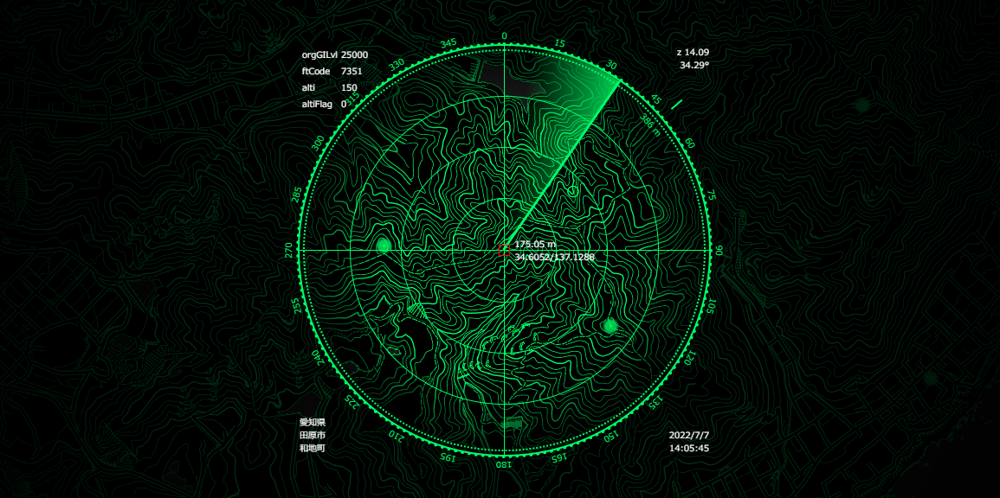

# radar-scan-decoration-webmap
レーダー風な装飾のお遊びWeb地図サイト

https://mghs15.github.io/radar-scan-decoration-webmap/

* 上記のデモサイトは基準点をスキャンするようなイメージです。
* もちろん実際はスキャンなんてしていません。
* Web地図としてはたいそう使いにくいです。
* データの一部に[地理院タイル](https://maps.gsi.go.jp/development/ichiran.html)を利用しています。
* ロジックの一部も[地理院地図Vector](https://maps.gsi.go.jp/vector/)から持ってきています。
* 表示している数値は雰囲気づくりのためで、一部、利用にそぐわないデータもありますので要注意。

## 参考文献
* https://developer.mozilla.org/ja/
* https://docs.mapbox.com/
* https://maps.gsi.go.jp/vector/
* https://wiki.openstreetmap.org/wiki/Slippy_map_tilenames
* https://www.modis.co.jp/candidate/insight/column_129
